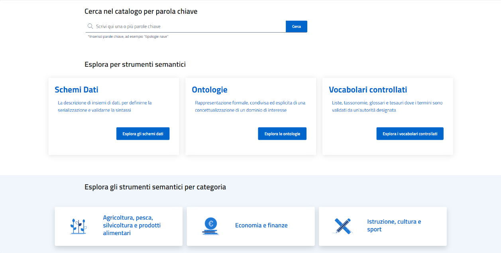
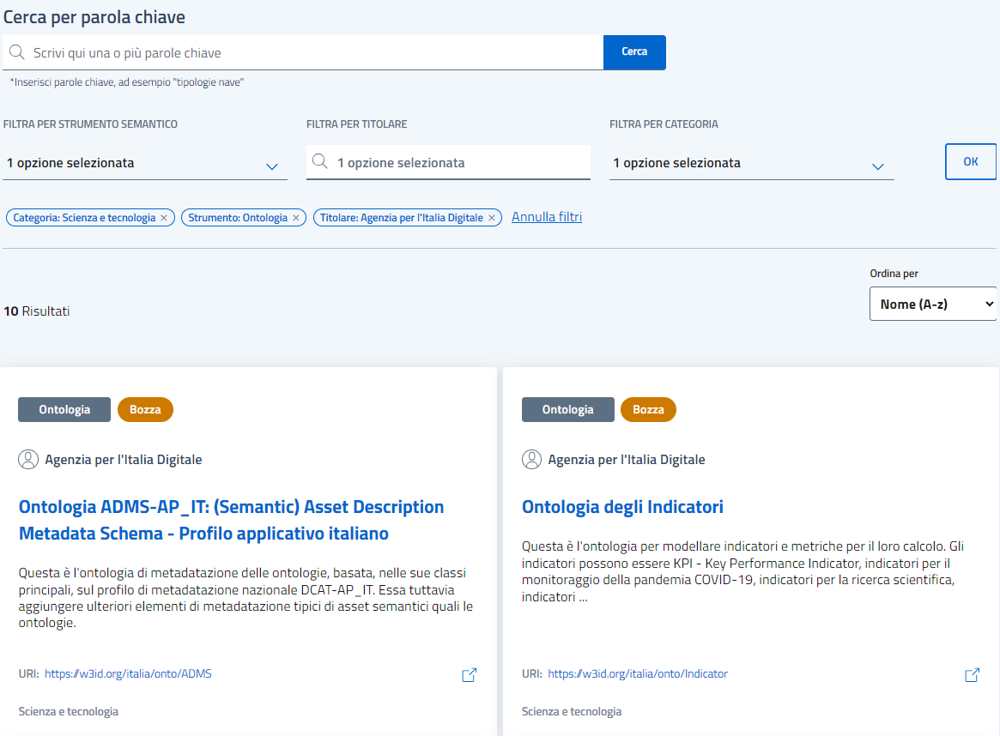

Ricerca di risorse semantiche
=============================

La ricerca degli asset semantici può essere effettuata direttamente
sull’homepage del Catalogo utilizzando l’apposito textbox, oppure
selezionando sulle diverse categorie/tipologie degli asset semantici,
come illustrato nella figura sottostante.

Figura 3 Homepage di schema.gov.it – Ricerca asset semantici

La ricerca tramite textbox permette agli utenti del Catalogo una rapida
individuazione delle risorse desiderate, fornendo in input le **parole
chiave** di interesse; in particolare, la textbox è supportata da
appositi indici che abilitano la ricerca testuale per titolo, keyword,
termini contenuti nella descrizione, titolare e concetti principali
della risorsa.

.. figure:: ../../media/image4.png
   :alt: Figura 4 Homepage di schema.gov.it – Ricerca asset semantici (Esplora il catalogo)
   :width: 6.13542in
   :height: 2.1057in

Figura 4 Homepage di schema.gov.it – Ricerca asset semantici (Esplora
il catalogo)

In aggiunta alla precedente modalità di ricerca, è possibile cliccare su
'Esplora il catalogo' e di conseguenza accedere ad una pagina di
ricerca avanzata che ne estende le funzionalità di filtraggio delle
risorse.

Figura 5 Catalogo – Ricerca asset semantici a partire da 'Esplora il
catalogo'

In particolare, è possibile filtrare le risorse per:

- **parole chiave**: la funzionalità di ricerca è analoga a quella
descritta per la homepage, ma in questo caso può essere coadiuvata dalle
successive.

- **tipologia**: tutte (opzione di default), ontologia, vocabolario
controllato, schema.

- **categoria**: ad esempio Energia, Ambiente, Trasporti.

- **titolare**: ad esempio INPS, ISPRA, AIA.

L’utente può configurare uno, più o tutti i filtri per poi cliccare il
tasto 'OK' e ottenere i risultati della propria ricerca.

Inoltre, l’utente può rimuovere filtri applicati nella ricerca
precedente servendosi delle filter chip mostrate appena sotto gli
elementi di configurazione della ricerca, e/o aggiungere nuovi valori ai
filtri, per poi cliccare 'OK' e ottenere i nuovi risultati di ricerca.

Per ciascun risultato di ricerca, l'utente visualizza le anteprime delle
risorse individuate (nessuna se il filtraggio è troppo restrittivo); per
ciascuna di esse, è possibile cliccare il titolo e accedere alla
relativa scheda di dettaglio. Ulteriori dettagli sulle schede dettaglio
degli asset semantici sono forniti nelle sotto-sezioni seguenti.
