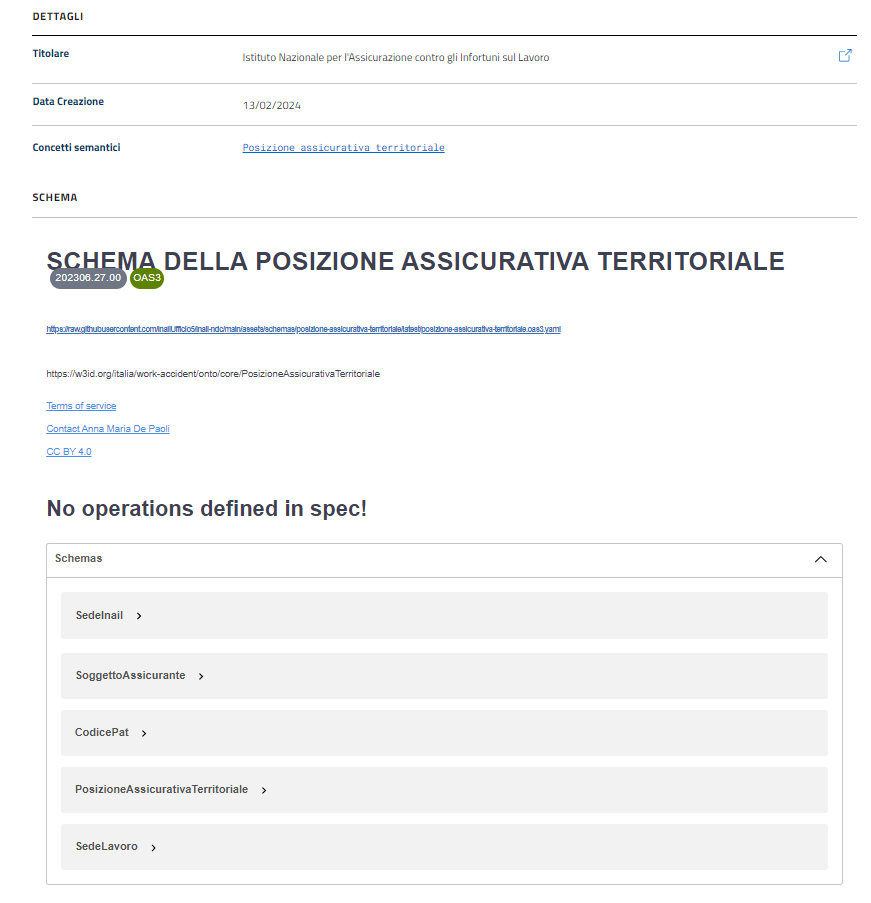

Scheda della risorsa semantica
==============================

Ontologia
---------

La scheda di dettaglio di un'ontologia fornisce informazioni quali il
titolo, la descrizione, e mostra due tasti che permettono di accedere
alle due funzionalità 'SPARQL' e 'Vai al sorgente'.

.. figure:: ../../media/image6.png
   :alt: Figura 6 Esempio schermata della scheda di un'ontologia
   :width: 5.46087in
   :height: 2.74051in

Figura 6 Esempio schermata della scheda di un'ontologia

In particolare:

-  Il tasto 'SPARQL' permette di accedere all’endpoint SPAQL ed
   effettuare interrogazioni sull’ontologia, interagendo col Graph Store
   del Catalogo.

.. figure:: ../../media/image7.png
   :alt: Figura 7 Interfaccia per l'esecuzione di interrogazioni mediante SPARQL Query Editor
   
   Figura 7 Interfaccia per l'esecuzione di interrogazioni mediante SPARQL
   Query Editor

-  Il tasto 'Vai al sorgente' permette di accedere al repository
   sorgente della risorsa semantica, dove eventualmente l'utente può
   aprire nuove issue.

Nella scheda della risorsa è presente anche una tabella che contiene i
dettagli dell’ontologia. Tra i vari elementi cliccabili in tabella vi è
il campo 'URI', che permette di accedere al visualizzatore lode - un
visualizzatore HTML di ontologie espresse in RDFS e OWL - dove l'utente
ha la possibilità di esaminare varie caratteristiche dell'ontologia, tra
cui le classi, le proprietà, nonché informazioni di carattere generale
quali la versione corrente, gli autori e altre modalità di
visualizzazione.

.. figure:: ../../media/image8.png
   :alt: Figura 8 Esempio visualizzatore lode di un’ontologia
   :width: 5.12986in
   :height: 2.59097in

Figura 8 Esempio visualizzatore lode di un’ontologia

Vocabolario controllato
-----------------------

La scheda di dettaglio dei vocabolari controllati contiene pressoché gli
stessi elementi descritti per le ontologie.

.. figure:: ../../media/image9.png
   :alt: Figura 9 Esempio schermata della scheda di un vocabolario controllato
   :width: 5.54792in
   :height: 2.79792in

Figura 9 Esempio schermata della scheda di un vocabolario controllato

Per i vocabolari controllati è presente un tasto aggiuntivo, 'API', che
permette di accedere alla Swagger UI e quindi fruire del vocabolario
controllato tramite un’apposita API.

.. figure:: ../../media/image10.png
   :alt: Figura 10 Interfaccia Swagger UI per vocabolario controllato
   :width: 5.29792in
   :height: 2.67847in

Figura 10 Interfaccia Swagger UI per vocabolario controllato

Anche in questo caso, è presente una tabella che contiene i dettagli
della risorsa semantica, con un importante differenza: il campo 'URI'
rimanda non più al visualizzatore lode, bensì lodview - un software
aperto di dereferenziazione di URI che consente di navigare i dati via
Web - dove l'utente ha la possibilità di esaminare varie caratteristiche
del vocabolario controllato correlate al linguaggio RDF.

.. figure:: ../../media/image11.png
   :alt: Figura 11 Esempio visualizzatore lodview di un vocabolario controllato
   :width: 5.63478in
   :height: 2.85652in

Figura 11 Esempio visualizzatore lodview di un vocabolario controllato

Schema
------

La scheda di dettaglio per gli schemi dati mostra il titolo, la
descrizione e il tasto 'Vai al sorgente' con funzionamento analogo a
quello descritto per ontologie e vocabolari controllati.

In aggiunta, è presente una tabella che contiene, oltre alle
informazioni di base della risorsa, una visualizzazione Swagger UI
completamente integrata, e che abilita la fruizione dello schema dati
mediante la visualizzazione estesa dei vari campi della sezione
'schemas'.

Figura 12 Esempio di tabella contenuta in una scheda per gli schemi dati

Richiesta di aggiornamento di asset semantici esistenti
-------------------------------------------------------

A partire dalla scheda di dettaglio di qualsiasi asset semantico nel
Catalogo, è possibile cliccare su un tasto 'Vai al sorgente' per essere
indirizzati sul repository GIT che contiene i dati su cui è stato
effettuato l’harvesting. In tal modo, è possibile non solo consultare i
codici sorgenti delle risorse semantiche, ma anche aprire eventuali
issue nel caso in cui siano stati rilevati errori sui relativi contenuti
semantici.

Nel caso di richiesta di integrazioni, il Contributore o l’utente che
apre la issue dovrà fare riferimento alle indicazioni tecniche fornite
in `sezione
5.3 <../manuale-operativo/indicazioni-su-aggiornamento-di-asset-semantici-esistenti.html>`__.