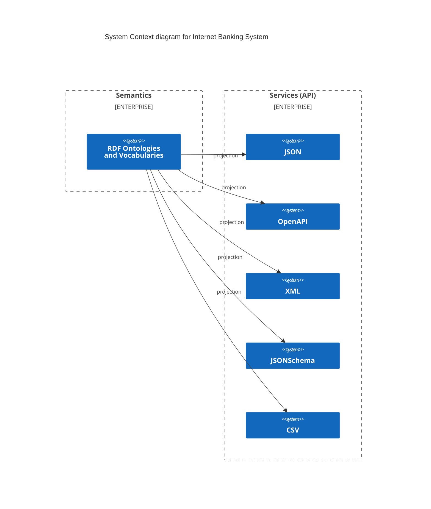

# Introduzione alla semantica


## Cos’è la semantica?

La strategia digitale italiana vuole uniforme le API prodotte da migliaia di agenzie pubbliche.
Tutte queste API devono essere semanticamente interoperabili, cioè devono essere basate su un insieme ben definito di concetti.

La semantica è lo studio del significato e garantisce che venga compreso un messaggio

Prendiamo questo messaggio API: è un nome proprio o un nome completo?
Qual è il nome proprio?


```yaml
{ name: "FABIANO Romildo" }
```

Non possiamo fare mash-up di API con diversi formati e significati.

Nel settore pubblico, è ancora più complesso perché il significato di
un termine (ad es. "Famiglia") dipende dalle normative specifiche (ad es. Famiglia fiscale,
Famiglia registrata, ...).

I vocabolari controllati sono uno strumento di informatica che utilizza
gli URI per disambiguare il significato dei termini:
ogni termine è identificato da un URI, contestualizzato con il nome del vocabolario
che fornisce uno spazio per i termini.

Il prefisso identifica il nome del vocabolario

```
https://dbpedia.org/data/      Dog       'The dog is a four leg animal'
--------------------------  ----------   ------------------------------
vocabulary name (prefix)       term       definition (rdfs:comment)
```

Esistono dei vocabolari standard a livello globale che contengono termini
utili a definire ulteriori vocabolari:

- [RDF](https://www.w3.org/TR/rdf-concepts/)
- [RDFS](https://www.w3.org/TR/rdf-schema/)
- [OWL](https://www.w3.org/TR/owl/)
- [SKOS](https://www.w3.org/TR/skos/)

L'Italia e l'Europa pubblicano inoltre ulteriori vocabolari ufficiali utili a creare servizi digitali.
Questi vocabolari possono anche descrivere in modo molto dettagliato dei dataset, come ad esempio il vocabolario dei paesi del mondo:

```turtle
@prefix dc: <http://purl.org/dc/elements/1.1/> .
@prefix dcterms: <http://purl.org/dc/terms/> .
@prefix rdf: <http://www.w3.org/1999/02/22-rdf-syntax-ns#> .
@prefix skos: <http://www.w3.org/2004/02/skos/core#> .
@prefix xsd: <http://www.w3.org/2001/XMLSchema#> .

<http://publications.europa.eu/resource/authority/country/ITA> a euvoc:Country,
        skos:Concept ;
    dc:identifier "ITA" ;
    euvoc:euroCurrencyAdoptionDate "1999-01-01"^^xsd:date ;
    skos:prefLabel "Итaлия"@bg,
        "Italia"@eu,
        "Italia"@it
.

...
```


## Rendere la semantica accessibile

Chi sviluppa servizi web di solito non conosce i meccanismi e gli standard del web semantico
(e.g. RDF, JSON-LD, ...). D'altro canto chi si occupa di semantica non conosce le problematiche
legate alla creazione e all'operatività dei servizi digitali (e.g. scalabilità, performance, ...).
Questo fa sì che le classi semantiche non sempre siano adatte a modellare gli schemi dati
concretamente usati per scambiare efficientemente informazioni tra servizi web.

Ad esempio, il vocabolario dei paesi del mondo descritto in precedenza non è particolarmente
semplice da usare in un'API o per compilare un modulo web.
Pubblicare vocabolari in formati che sono ben noti
agli sviluppatori web come JSON e CSV facilita il loro utilizzo
e migliora la qualità complessiva dei dati.

Ad esempio, è possible processare il vocabolario degli Stati ed erogarlo sotto forma di CSV,
JSON o addirittura JSON Schema, in modo che possano essere utilizzato in delle API o per un modulo online.


