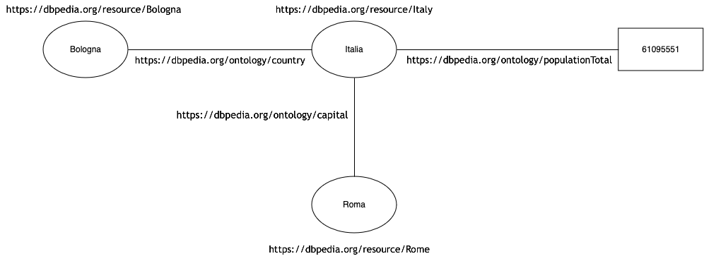
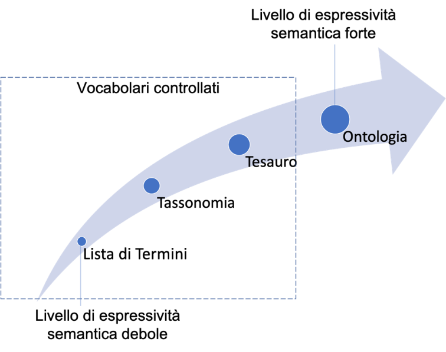

I pilastri della semantica dei dati
===================================

Attribuire un’identità alle cose del mondo: URI(IRI)
----------------------------------------------------

È sempre bene strutturare i dati privilegiando l’individuazione di
entità e riducendo l’uso di descrizioni testuali (“*things, not
strings”)*. Le entità possono poi essere identificate univocamente
attraverso l’uso di identificativi univoci e persistenti a cui riferirsi
in maniera condivisa, risolvendo così il problema dell’identità anche
nell’interscambio dei dati.

Si definisce Uniform Resource Identifier (URI) una sequenza di caratteri
che identifica univocamente e in maniera persistente nel tempo una
risorsa (nel web). Si usa il termine IRI - International Resource
Identifier quando si parla di un identificativo che consente l'utilizzo
di caratteri adatti a lingue diverse dall'inglese.

Un esempio di URI è il seguente:
https://w3id.org/italia/lombardia/data/construction/1A060-00365.

Esso segue le `linee guida open data per la definizione di URI univoci e
persistenti nel
tempo <https://www.agid.gov.it/sites/default/files/repository_files/lg-open-data_v.1.0_1.pdf>`__
a cui si rimanda.

Nella gestione degli URI, come riportato nelle suddette linee guida, si
ricorda in questo contesto che è necessario abilitare:

-  **meccanismi di “content negotiation”** nella richiesta di una
   risorsa: questi consentono di rendere disponibile, allo stesso URI,
   diverse rappresentazioni di una risorsa in caso di molteplici
   rappresentazioni/formati della stessa;

-  **meccanismi di dereferenziazione degli URI**: se utilizzati con un
   browser, gli URI devono restituire una rappresentazione web (ad
   esempio una pagina web informativa) della risorsa che identificano.

Collegare i dati con l’uso di standard aperti e condivisi
---------------------------------------------------------

L’uso di standard aperti e condivisi, che offrono nativamente la
possibilità di collegare dati, agevola l’interoperabilità e
l’integrazione dei dati.

Nel contesto del Web Semantico, gli standard riportati nel seguito sono
quelli di riferimento per raggiungere questi obiettivi.

Standard RDF – Resource Description Framework
~~~~~~~~~~~~~~~~~~~~~~~~~~~~~~~~~~~~~~~~~~~~~

Le risorse web semantiche sono descritte in termini di entità, che hanno
un tipo, e di relazioni tra entità che hanno un significato.

La forma di rappresentazione è quella della tripla
soggetto-predicato-oggetto, dove il soggetto è un nodo che ha sempre un
URI/IRI, il predicato è un arco che ha sempre un URI/IRI, l’oggetto può
essere una semplice stringa, un numero, una data, un booleano, oppure un
nodo con un URI/IRI così da diventare potenzialmente il soggetto di
un’altra tripla. Quest’ultimo meccanismo consente di concatenare triple,
creando così i presupposti per collegare i dati a formare un grafo
interconnesso di conoscenza (figura 14).

   Figura 14: Esempio di grafo interconnesso di conoscenza

Lo standard RDF, pertanto, offre un modello di rappresentazione di dati
semanticamente arricchiti e collegati nel Web e può essere serializzato
(o reso disponibile) attraverso diversi formati.

Alcuni formati noti dello standard RDF
~~~~~~~~~~~~~~~~~~~~~~~~~~~~~~~~~~~~~~

**RDF/XML**

`RDF/XML <https://www.w3.org/TR/rdf-syntax-grammar/>`__ è una sintassi
XML usata per rappresentare dati espressi secondo il modello RDF. I file
RDF/XML hanno estensione .rdf.

Un esempio di serializzazione RDF/XML, per rappresentare
un’organizzazione pubblica dal nome “Consiglio Nazionale delle Ricerche
– CNR” e con il suo codice IPA associato, è quello di seguito:

::

   <?xml version="1.0" encoding="utf-8" ?>

   <rdf:RDF xmlns:rdf="http://www.w3.org/1999/02/22-rdf-syntax-ns#"

            xmlns:cov="https://w3id.org/italia/onto/COV/">

     <rdf:Description rdf:about="https://w3id.org/italia/data/organisation/cnr">

       <rdf:type rdf:resource="https://w3id.org/italia/onto/COV/PublicOrganization"/>

       <cov:legalName xml:lang="it">Consiglio Nazionale delle Ricerche - CNR</cov:legalName>

       <cov:IPACode>cnr</cov:IPACode>

     </rdf:Description>

   </rdf:RDF>

**RDF/Turtle**

`RDF/Turtle <https://www.w3.org/TR/turtle/>`__ è una sintassi che
consente di rappresentare un grafo RDF in una forma di testo compatta,
ad oggetti (tutte le triple associate a un soggetto), più leggibile
anche dalle persone.

I file RDF/Turtle hanno estensione .ttl.

Lo stesso esempio utilizzato per la serializzazione RDF/XML è
rappresentato nel formato RDF/Turtle di seguito.

::

   @prefix cov: <https://w3id.org/italia/onto/COV/> .

   <https://w3id.org/italia/data/organisation/cnr> a cov:PublicOrganization ;

     cov:legalName "Consiglio Nazionale delle Ricerche - CNR"@it ;

     cov:IPACode "cnr" .

**JSON-LD**

`JSON-LD <https://www.w3.org/TR/json-ld11/>`__ è una sintassi JSON usata
per rappresentare dati espressi secondo il modello RDF. La sintassi è
definita per potersi integrare agevolmente nei sistemi che già
utilizzano JSON e fornisce un percorso di transizione da JSON a JSON-LD.
Nasce principalmente come un modo per utilizzare dati interconnessi in
grafi della conoscenza in ambienti di programmazione basati sul Web, per
costruire servizi Web interoperabili e per memorizzare i dati in motori
di archiviazione basati su JSON.

I file JSON-LD hanno estensione .jsonld.

Lo stesso esempio utilizzato per le serializzazioni RDF/XML e RDF/Turtle
è illustrato di seguito nel formato JSON-LD.

::

   {

     "@context": {

       "rdf": "http://www.w3.org/1999/02/22-rdf-syntax-ns#",

       "cov": "https://w3id.org/italia/onto/COV/"

     },

     "@id": "https://w3id.org/italia/data/organisation/cnr",

     "@type": "cov:PublicOrganization",

     "cov:IPACode": "cnr",

     "cov:legalName": {

       "@language": "it",

       "@value": "Consiglio Nazionale delle Ricerche - CNR"

     }

   }

Dare un significato alle cose del mondo
---------------------------------------

Per garantire che il significato dei dati sia preservato durante
l’interscambio è necessario esplicitare il loro significato. Questo
comporta definire, in modo più o meno articolato, tipi e relazioni tra
tipi.

Per definire il significato dei dati si usano strumenti quali i
vocabolari controllati e/o le ontologie, descritti di seguito.

.. _vocabolario-controllato-1:

Vocabolario controllato 
~~~~~~~~~~~~~~~~~~~~~~~~

Con il termine *vocabolario controllato* si intende un elenco
standardizzato di concetti denotati da termini di riferimento e da
codici. L’elenco è utile per organizzare, descrivere, predefinire e
indicizzare conoscenza di un dominio (e.g., il vocabolario controllato
sulla tipologia di beni culturali italiani).

Esistono alcune tipologie di elenchi di concetti che rientrano sotto il
termine generale di “vocabolari controllati”:

-  **Lista di termini (Code List)**: Una lista di concetti identificati
   da un codice e denotati da un termine;

-  **Tassonomia (Taxonomy)**: L’elenco di concetti, con i relativi
   termini principali e codici, è organizzato in una struttura
   gerarchia, dove le categorie più ampie possono ricomprendere
   sottocategorie più ristrette (e.g., Animale – Cane, Gatto);

-  **Tesauro (Tesauri)**: L’elenco di concetti è organizzato in maniera
   più articolata delle due tipologie precedenti. In un tesauro i
   concetti possono essere in relazione tra loro, non solo in forma
   gerarchica ma anche in forma di correlazione o per indicare che un
   termine di un concetto è sinonimo di un altro termine. In generale,
   un tesauro dovrebbe includere anche le definizioni associate a
   ciascun concetto.

Buona e diffusa pratica è quella di utilizzare un’ontologia per definire
vocabolari controllati di tutti i tipi. Questa ontologia è uno standard
del Web e si chiama `SKOS - Simple Knowledge Organization
System <https://www.w3.org/TR/skos-reference/>`__.

Di seguito è riportato un estratto di uso di SKOS per definire la lista
di termini del sesso di una persona, rappresentati nel formato
RDF/Turtle.

::

   <https://w3id.org/italia/controlled-vocabulary/classifications-for-people/sex/F>

    a skos:Concept ;

    skos:inScheme <https://w3id.org/italia/controlled-vocabulary/classifications-for-people/sex> ;

    skos:notation "F" ;

    skos:prefLabel "Femmina"@it , "Female"@en .

Nell’esempio, il concetto di femmina ha un URI associato ed è definito
come un concetto secondo SKOS (Concept) che si trova in un vocabolario
più ampio sul sesso (la proprietà SKOS inScheme), che ha un codice “F”
(la proprietà SKOS notation) e che ha un termine principale o preferito
(la proprietà SKOS prefLabel) espresso nelle due lingue dell’italiano e
dell’inglese.

.. _ontologia-1:

Ontologia
~~~~~~~~~

In ambito informatico, con il termine *ontologia* si intende una
specifica formale, condivisa ed esplicita di una rappresentazione
(concettualizzazione) di un dominio di conoscenza, definita sulla base
di requisiti specifici. La rappresentazione consiste nella definizione
di entità (o classi), di attributi di entità e di relazioni tra entità.

Un’ontologia offre una semantica molto più forte di quella offerta da
semplici vocabolari controllati o da semplici dizionari: attraverso la
definizione dei suoi assiomi logici, ossia affermazioni che, andando
oltre la semplice enunciazione di principi universalmente veri,
permettono di esprimere relazioni e vincoli specifici tra entità
(classi) all'interno dell'ontologia (e.g., assiomi di equivalenza, di
disgiunzione tra membri di classi, ecc.), è possibile abilitare un
ragionamento automatico, verificare la coerenza nelle definizioni,
inferire nuova conoscenza.

In generale, le ontologie svolgono un ruolo cruciale nella
strutturazione e gestione della conoscenza, rendendo le informazioni più
accessibili, interpretabili e utilizzabili sia dagli esseri umani che da
macchine.

Esistono degli standard del Web che consentono di creare ontologie. Gli
standard sono:

-  `RDFS – RDF Schema <https://www.w3.org/TR/rdf-schema/>`__: è un
   vocabolario leggero che estende il modello RDF per descrivere
   semanticamente dati RDF. Esso fornisce elementi basilari per creare
   ontologie (e.g., definisce se una classe è sottoclasse di un’altra,
   il dominio e codominio delle proprietà tra classi, ecc.)

-  `OWL – Web Ontology
   Language: <https://www.w3.org/TR/owl-features/>`__ è un linguaggio
   per la rappresentazione della conoscenza che si basa su RDF e RDFS ma
   che offre capacità più espressive per definire la semantica dei dati
   (e.g., vincoli di cardinalità per specificare il numero di istanze
   che una proprietà può avere, operatori logici per definire relazioni
   complesse, ecc.).

Di seguito si riporta un estratto, a titolo d’esempio, dell’ontologia
OWL sulle persone, espressa nel formato RDF/Turtle.

::

   ### Proprietà haSesso

   :hasSex rdf:type owl:ObjectProperty ;

           rdfs:domain :Person ;

           rdfs:range :Sex ;

           rdfs:comment "La relazione che lega una persona al suo sesso"@it ,

           rdfs:isDefinedBy <https://w3id.org/italia/onto/CPV> ;

           rdfs:label "ha sesso"@it ,

                      "has sex"@en .

   ### Classe Persona Fisica

   :Person rdf:type owl:Class ;

           rdfs:subClassOf 

   		  [ rdf:type owl:Restriction ;

                   owl:onProperty :hasSex ;

                   owl:qualifiedCardinality "1"^^xsd:nonNegativeInteger ;

                   owl:onClass :Sex

                 ];

          rdfs:comment "Un singolo essere umano che può essere vivo o morto. Secondo la definizione giuridica è ogni essere umano che assume, dal momento della nascita, lo stato di soggetto di diritto e come tale una capacità giuridica, ovvero la titolarità di diritti e doveri e l'assunzione di una posizione nelle situazioni giuridiche soggettive."@it ;

           rdfs:isDefinedBy <https://w3id.org/italia/onto/CPV> ;

           rdfs:label "Person"@en ,

                      "Persona fisica"@it .

Nell’esempio esiste una proprietà tra classi haSex che collega la classe
Person (rdfs:domain) alla classe Sex (rdfs:range) ed esiste la
definizione della classe Person (owl:Class). Per la classe Person,
l’esempio fornisce anche la definizione in OWL di vincoli di
cardinalità. In particolare, si sta definendo che tutte le persone
formano un sottoinsieme di tutte le cose che hanno un sesso.

Relazione tra ontologie e vocabolari controllati
~~~~~~~~~~~~~~~~~~~~~~~~~~~~~~~~~~~~~~~~~~~~~~~~

Da quanto sopra riportato è evidente che, sebbene le ontologie e i
vocabolari controllati consentano di dare un significato ai dati e
possano essere entrambi definiti per rappresentare la conoscenza di un
certo dominio di interesse, il livello di profondità semantica offerta
dai due strumenti è diverso.

La figura 15 mostra il grado di profondità semantico offerto dai
vocabolari controllati, di diverso tipo, rispetto alle ontologie.

   Figura 15: Livelli di espressività semantica

Dare la possibilità di interrogare i dati
-----------------------------------------

Nell’ambito della semantica, è necessario fornire strumenti che
consentano di interrogare i dati, sia in un’interazione di tipo
persona-macchina che in una di tipo macchina-macchina.

Lo Standard SPARQL - SPARQL Protocol and RDF Query Language
~~~~~~~~~~~~~~~~~~~~~~~~~~~~~~~~~~~~~~~~~~~~~~~~~~~~~~~~~~~

Nel contesto di dati semanticamente arricchiti ed espressi nella forma
di triple, esiste uno standard orientato ai dati che permette di
navigarli e interrogarli, anche se provenienti da sorgenti diverse e
distribuite sulla rete (interrogazioni federate). Lo standard è
`SPARQL <https://www.w3.org/TR/sparql11-query/>`__ ed è sia un
linguaggio per l’interrogazione di grafi RDF simile a SQL, sia un
protocollo. Quest’ultimo aspetto rende SPARQL uno standard attraverso
cui è possibile trasmettere interrogazioni e aggiornamenti SPARQL a un
servizio di elaborazione SPARQL che restituisce i risultati via HTTP
all’applicazione cliente che li ha richiesti, abilitando così
un’interazione macchina-macchina su protocollo HTTP.

Un esempio di interrogazione SPARQL è quello di seguito: essa consente
di ottenere tutti gli URI dei concetti, le etichette principali in tutte
le lingue, se esistenti, e i codici del vocabolario controllato sul
sesso.

::

   PREFIX skos: <http://www.w3.org/2004/02/skos/core#>

   select ?concetto ?etichetta ?codice

   where {

      ?concetto a skos:Concept ;

      skos:inScheme <https://w3id.org/italia/controlled-vocabulary/classifications-for-people/sex> ;

      skos:prefLabel ?etichetta ;

      skos:notation ?codice .

   }